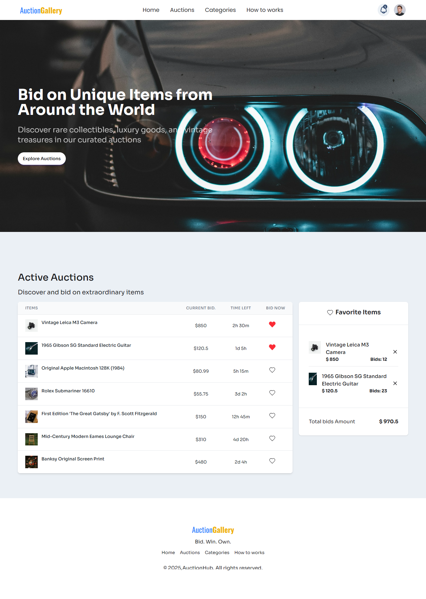

<<<<<<< HEAD
# bokul-spa-react
=======
# 🎯 React Bid Items Assignment

This is a React-based assignment project focused on creating a bidding platform UI using JSON data, with features like favorite item tracking, toast notifications, and proper UI based on Figma design.

---

## 🌟 Features & Requirements Fulfilled

### ✅ Navbar
- Designed exactly as per the provided Figma design.

### ✅ Banner
- Implemented the banner section matching Figma specifications.

### ✅ JSON Data for Bid Items
- Created `bidItems.json` with at least 6 items, each containing:
  - `id`
  - `title`
  - `description`
  - `currentBidPrice`
  - `timeLeft`
  - `bidsCount`
  - `image`

### ✅ Active Auctions Section
- Displays 6 bid items with:
  - Item image
  - Item name
  - Current bid price
  - Time left
  - "Bid Now" button
  - ❤️ Favorite button

### ✅ Favorite Items Section
- Initially shows title, "No items" message, and total amount = 0
- On clicking ❤️:
  - Item is added to favorite list
  - Favorite item displays:
    - Name
    - Bid price
    - Bids count
    - ❌ Remove icon
  - Total price updates accordingly

### ✅ React-Toastify Integration
- Integrated `react-toastify` to show toast when an item is added to favorites

### ✅ Footer
- Designed footer matching the Figma design

---

## ⚔️ Challenge Requirements

- ✅ Displayed bid items in **table format**
- ✅ ❤️ Button becomes:
  - Red
  - Disabled with `cursor: not-allowed`
- ✅ ❌ Remove functionality:
  - Item removed from favorites
  - Total price updated accordingly

---

## 🧠 Additional Guidelines Followed

- Used **meaningful and relevant text** instead of placeholder content
- **Avoided gobindo colors** – used a professional color scheme
- Maintained **clean Git history** with **8 meaningful commits**
- Wrote semantic and accessible HTML/JSX

---

## 🚀 How to Run

1. Clone the repo:
   ```bash
   git clone https://github.com/Bokul98/bokul-spa-react
   cd your-repo-name

>>>>>>> 6c08ec9 (React Project)
